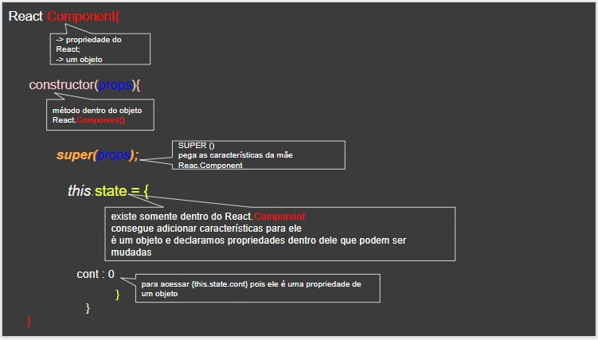
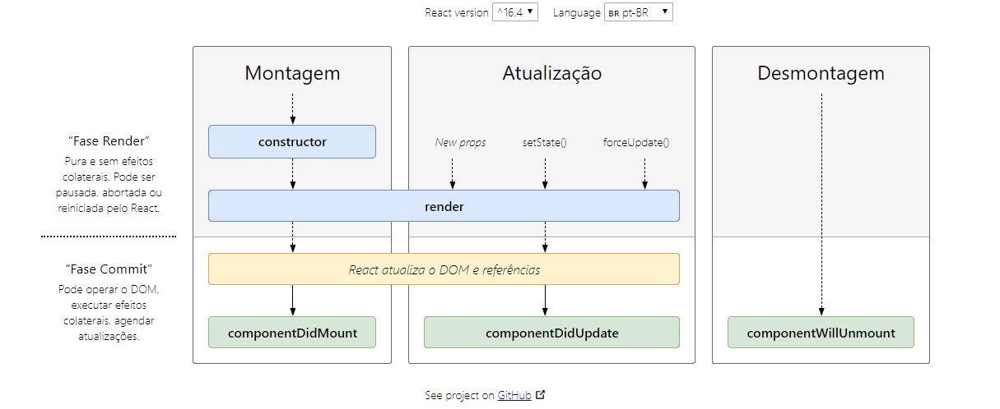
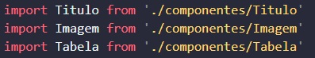

# Semana 01  React -- ESTADO, CONDICIONAIS, CICLO DE VIDA, IMPORATAÇÃO E EXPORTAÇÃO DE COMPONENTES

_Para clonar esse repositório usar o comando_

```
cd my-app
npm install 
npm start

```

_colar o exercicio desejado no **index.js**_

## Estado

* O \ReactDOM.render()\ faz a conexão do meu código js para a tela, porém toda vez que ele é chamado a tela renderiza (atualiza)

* Para que isso não ocorra o React possui uma método que redenriza apenas aquele elemento.



```javascript

let cont = 0;

class Contador extends React.Component{
    constructor(props){
        super(props);
        this.state = {
            cont: 0
        }    
    }
    
    /*

    EXEMPLO DE setState()

    this.setState -> é um método que possuí como parâmetro uma função que sempre retorna um objeto
    quando eu quiser alterar uma propriedade contida no this.state eu preciso colocar um parâmetro dentro da função

    ex.: this.setState((alterarPropriedade) => {
        return{
            propriedadeDoThisState : alterarPropriedade.propriedadeDoThisState + 1
        }
    })
    */

    addUm =() =>{
        this.setState((estadoAnterior) => {
            return {
                cont: estadoAnterior.cont + 1
            }
        })
        
    }

    reset =() =>{
        this.setState(() => {
            return {
                cont: 0
            }
        }) 
    }

    render(){
        return(
            <div>
                
                <h2>Count: {this.state.cont}</h2>
                <button onClick={this.addUm}>+1</button>
                <button onClick={this.reset}>Reset</button>
                <p>{this.state.cont !== 0 ? 'Contador iniciado' : 'Contador não iniciado'}</p>
            </div>
        )
    }

}

ReactDOM.render(<Contador />, document.getElementById('root'));


```

### Exercício 01

```javascript


class Esconde extends React.Component{
    constructor(props){
        super(props);
        this.state = {
            mudar: false
        }
    }
    
    mudarEstado =() =>{
        // if(this.state.mudar === '') {
        //     this.setState(() => {
        //         return {
        //             mudar: 'Esconde-Aparece' 
        //         }
        //     })
        // } else{
        //     this.setState(() => {
        //         return {
        //             mudar: '' 
        //         }
        //     })
        // }

        this.setState((estadoAnterior) => {
            return {
                mudar: !estadoAnterior.mudar
            }
        })
        
    }

    render(){
        return(
            <div>
                
                <h1>{this.state.mudar ? 'Esconde-Aparece' : '' }</h1>
                <button onClick={this.mudarEstado}>Mudar titulo</button>
            </div>
        )
    }

}

ReactDOM.render(<Esconde />, document.getElementById('root'));

```

<hr />


## CONDICIONAIS

* Ternário

```javascript

condição ? verdadeiro : falso

```

* &&

* Trabalha com a lógica de [Falsy](https://developer.mozilla.org/pt-BR/docs/Glossario/Falsy) e [Truthy](https://developer.mozilla.org/pt-BR/docs/Glossario/Truthy)
* Se o primeiro valor informado for verdadeiro e ele retorna o segundo valor de pois do &&
* Caso o primeiro valor informado seja faldo ele não retronará nada
* Mais usado quando não precisamos de um 'else'

```javascript

true && "retorna o segundo valor"

```

<hr />

## CICLO DE VIDA

* Quando uma instância de um componente está sendo criada e inserida no DOM:
    
    * [componentDidMount()](https://pt-br.reactjs.org/docs/react-component.html#componentdidmount)

* Quando um componente esta sendo re-renderizado:
    * [componentDidUpdate()](https://pt-br.reactjs.org/docs/react-component.html#componentdidupdate)

* Quando um componente está sendo removido do DOM:
    * [componentWillUnmount()](https://pt-br.reactjs.org/docs/react-component.html#componentwillunmount)


[Diagrama do Ciclo de Vida](http://projects.wojtekmaj.pl/react-lifecycle-methods-diagram/)



##IMPORTAR ARQUIVO

Importar componentes pro index.js 

EXEMPLO: 

```javascript

import React from 'react'; //SE FORMOS UTILIZAR ALGUMA PROPRIEDADE DO ARQUIVO REACT. NO CASO IREMOS UTILIZAR OS 'PROPS'


let Tabela = (props) => {
    return(
        
        <table className="previsao-temperatura">
            <tr className="previsao-temperatura__linha">
                <th>Máxima</th>
                <td>{props.temperatura.max}</td>
            </tr>
            <tr className="previsao-temperatura__linha">
            <th>Mínima</th>
            <td>{props.temperatura.min}</td>
            </tr>
        </table>
        
    )
}

export default Tabela; //SEMPRE utilido para que possamos importar esse arquivo em algum lugar 

// export dafault NomeDoArquivoQueVocêVaiChamar

```

No index.js colaremos dessa maneira:




### Exercício 02 

Transformar os componentes do [exercicio 03](https://github.com/myrmanso/reprograma-react/tree/master/semana_01/aula_03#exerc%C3%ADcio-03) de previsão do tempo em arquivos independentes e importa-los

./src/componentes/Titulo.js
```javascript

import React from 'react';

let Titulo = (props) => {
    return (
        <div>
            <h1 className="previsao__data">{props.data}</h1>
            <h2 className="previsao__resumo">{props.resumo}</h2>
        </div>
    )
}

export default Titulo;

```

.src/componentes/Imagem.js
```javascript

import React from 'react';

let Imagem = (props) => {
    return(
               
    )
}

export default Imagem;

```

./src/componentes/Tabela.js
```javascript

import React from 'react';


let Tabela = (props) => {
    return(
        
        <table className="previsao-temperatura">
            <tr className="previsao-temperatura__linha">
                <th>Máxima</th>
                <td>{props.temperatura.max}</td>
            </tr>
            <tr className="previsao-temperatura__linha">
            <th>Mínima</th>
            <td>{props.temperatura.min}</td>
            </tr>
        </table>
        
    )
}

export default Tabela;

```

.src/componentes/Previsao.js

Importo O Titulo, Imagem e a Tabela nesse arquivo pois a classe Previsão precisa deles para "existir"
Ou seja, ele utiliza esses componentes.

```javascript

import React from 'react'
import Titulo from './Titulo'
import Imagem from './Imagem'
import Tabela from './Tabela'

class Previsao extends React.Component{
    render(){
        return(
            
            <div className="previsao">
                < Titulo 
                data = {this.props.data}
                resumo = {this.props.resumo}
                />
                <Imagem 
                imagem = {this.props.imagem}
                />
                <Tabela 
                temperatura = {this.props.temperatura}
                />
                
            </div>
        
        )
    }
}

export default Previsao

```

./src/index.js
Eu importo somente a 'Previsao' pois eu estou chamando somente esse componente.

```javascript

import React from 'react';
import ReactDOM from 'react-dom';
import './index.css';
import './previsaoTempo.css';
import Previsao from './componentes/Previsao'
import * as serviceWorker from './serviceWorker';

//COLAR A BAIXO O EXERCÍCIO DESEJADO

const previsao31_05 = {
    data: '31/05/2019',
    resumo: 'Ensolarado',
    imagem: 'https://www.onlygfx.com/wp-content/uploads/2018/09/4-clipart-sun-1.png',
    temperatura: {
        max: 31,
        min: 20
    }
}
   
const previsao01_06 = {
    data: '01/06/2019',
    resumo: 'Nublado',
    imagem: 'https://cdn.pixabay.com/photo/2013/04/01/09/22/clouds-98536_960_720.png',
    temperatura: {
        max: 25,
        min: 18
    }
}

class Temperatura extends React.Component{
    render(){
        
        return(
            <div className= "previsao-container">
                <Previsao 
                data = {previsao31_05.data}
                resumo = {previsao31_05.resumo}
                imagem = {previsao31_05.imagem}
                temperatura = {previsao31_05.temperatura}
                />
                <Previsao 
                data = {previsao01_06.data}
                resumo = {previsao01_06.resumo}
                imagem = {previsao01_06.imagem}
                temperatura = {previsao01_06.temperatura}
                />

            </div>
        )
    }
}

ReactDOM.render(<Temperatura />, document.getElementById('root'));

```


